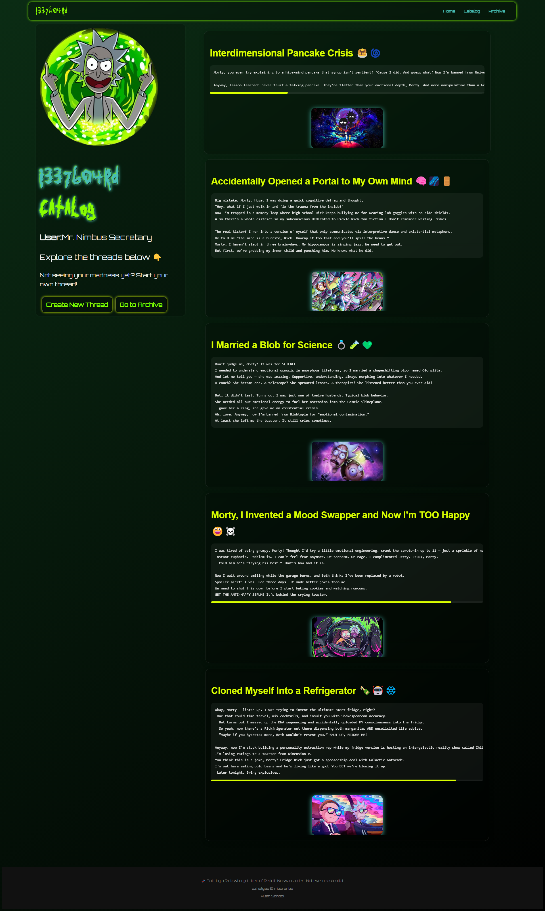
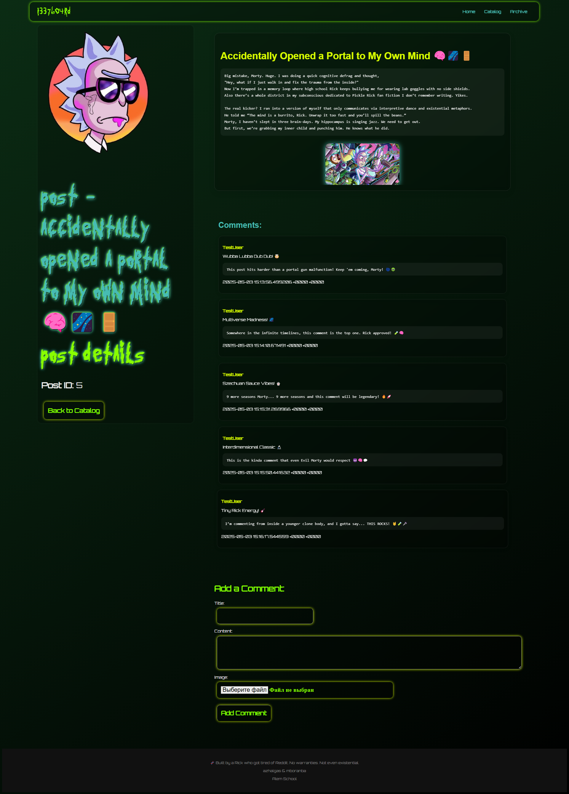
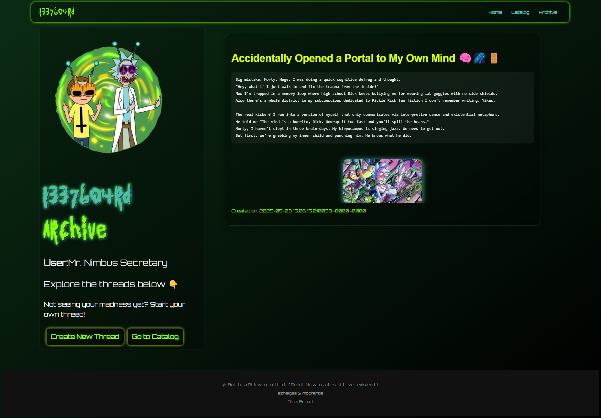
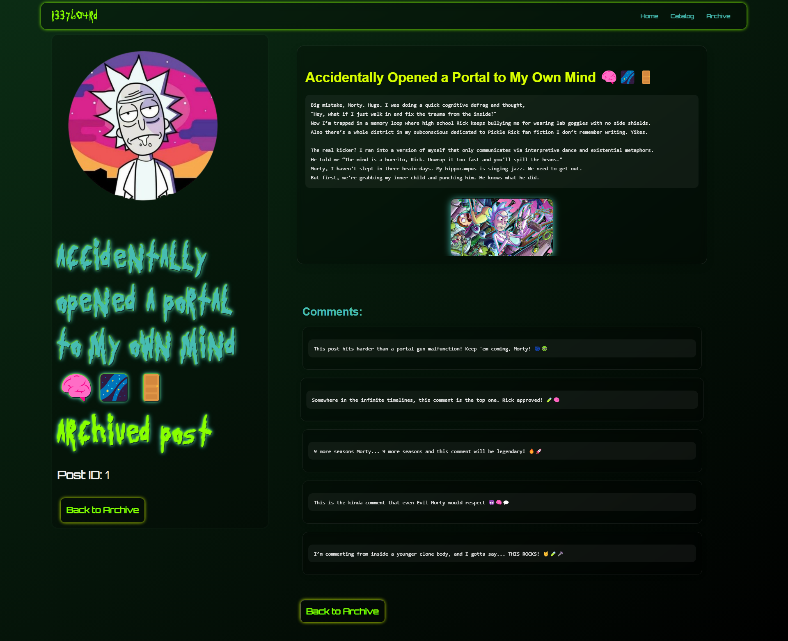
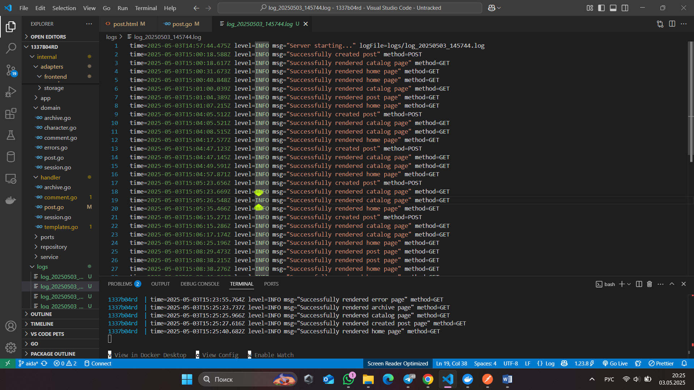

# 🧪 1337b04rd — Interdimensional Imageboard


> _"Sometimes science is more art than science, Morty. A lot of people don't get that."_ — **Rick Sanchez**

---

## 👽 What is 1337b04rd?

**1337b04rd** is not just a regular imageboard — it’s a portal into chaotic dimensions.  
Designed with a _blackhole aesthetic_ 🖤🕳 and radioactive green 💚 glow, it’s a tribute to everything wild, weird, and wicked in the multiverse.  
**Built by degenerates for degenerates**, it allows interdimensional lifeforms to post anonymously, scream into the void, and leave their mark in threads that decay like unstable antimatter.

_You don’t register. You don’t ask. You post and disappear..._  
Because in the multiverse, **identity is for cowards**.

---

## 🧑‍🔬 Authors

> Built across multiple timelines by renegade coders:

- 🧪 **Mboranba**
- 🧠 **Azhalgas**

> _"They coded so you could post... across realities."_

---

## 🌌 Tech Stack (Stuff Rick Wouldn't Bother Explaining)

| Layer        | Tech                                                                      |
|--------------|---------------------------------------------------------------------------|
| 💬 API       | RESTful, stateless, fast — the way Rick likes it                         |
| 🧠 Backend   | Golang, PostgreSQL, concurrency, S3 buckets with questionable contents     |
| 🧬 Avatars   | Rick & Morty API – every post gets a random dimension face                |
| 🍪 Sessions  | Cookies that last a week — or until the universe collapses                 |
| 🪐 Frontend  | Custom sci-fi UI, retro CRT themes + cosmic green vibes                   |
| 🧱 Arch       | Hexagonal architecture – ports, adapters, all that jazz                   |

---

## 🖼 UI Showcase (Straight from the Citadel of Ricks)

| 🏠 Home | 🧭 Catalog | 🧾 Post |
|--------|-----------|--------|
|  |  |  |

| 🪦 Archive | ☠️ Archive Post | 📉 Logger |
|-----------|-----------------|-----------|
|  |  |  |

---

## 🚀 Core Features

- 🧊 **Anonymous Posting** — Be anyone. Be no one. Be a Meeseeks.
- 🧪 **Self-Destructing Threads** — After ~10-15 minutes, posts decay like bad science experiments.
- 👽 **Dynamic Avatars** — Get a face from another universe. No two alike.
- 🌐 **Quote Replies** — Use post IDs to reference your fellow travelers.
- 🛰️ **Sci-fi UI** — Dark UI, CRT-style glow, green-acid highlights. Looks illegal. Probably is.
- 🧹 **The Archive Zone** — Deleted threads don’t die; they phase into the archive dimension.
- 🔐 **Session Cookies** — Persistent identities without registration. Who needs OAuth when you have chaos?

---

## 📡 Learning Objectives

- 🧱 Mastery of **Hexagonal Architecture** with Go
- 🌠 Deep API integration (Rick and Morty API)
- 🧊 Handling **sessions, tokens, and identity** like a real dimensional smuggler
- 🧪 Testing and structured logging in production-grade apps
- 🎨 Creating a **thematic frontend** that feels alive and pulsing with portal energy

---

## 📁 Project Structure
```
1337b04rd/
├── cmd/ # Entry point and main app logic
├── internal/
│ ├── adapter/ # Handlers and HTTP interfaces
│ ├── domain/ # Core models and logic
│ ├── repository/ # Database layer
│ └── usecase/ # Business logic (hexagonal ports)
├── assets/ # Frontend assets (images, styles, js)
├── web/ # Static site files
├── tests/ # Unit & integration tests
└── config/ # Environment, S3, database config
```


---

## 🛸 Future Plans

- 🌀 **Darknet Mode** — Switch to a more chaotic UI variant for ~true~ interdimensional degenerates
- 🧠 **AI-generated posts** — Let Ricks from other dimensions auto-respond to your threads
- 🎮 **Mini-games** — Interact with threads by solving puzzles from other timelines
- 🪞 **Mirror Dimensions** — Fork threads into parallel timelines

---

## 🧪 Final Thoughts

> _"Wubba Lubba Dub Dub!"_ means "**I am in great pain, please post memes**."

Welcome to **1337b04rd**. You're not supposed to be here, but neither is sanity.  
_This isn't Reddit. This isn't 4chan. This is the black void between them._

---

## 🟢 Live Demo

_You know what to do. Just don’t tell the Galactic Federation._


